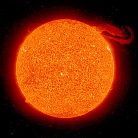

# Soleil
Le Soleil est une étoile âgée d'environ 4,57 milliards d’années28, soit un peu moins de la moitié de son chemin sur la séquence principale29. L'hypothèse des années 1970, selon laquelle une supernova serait à l'origine de l'effondrement de la nébuleuse qui a donné naissance au Soleil, n'est plus crédible. Une modélisation réalisée en 2012 propose un scénario en trois étapes pour expliquer la formation du Soleil et l'abondance de magnésium 26 et de nickel 60 dans les météorites. Ces éléments sont les produits de la décomposition de deux isotopes radioactifs (à la demi-vie relativement courte), nés dans les étoiles : l'aluminium 26 (demi-vie de 717 000 ans) et le fer 60 (demi-vie de 2,6 Ma). Pour comprendre la présence de ces éléments dans la chimie du Soleil, il fallait imaginer une étape pour le fer 60 et une autre pour l'aluminium 26.

Icone créée par [wikipedia](https://fr.wikipedia.org/wiki/Soleil) trouvée sur [wikipedia](https://fr.wikipedia.org/wiki/Soleil).

## Caractéristiques
- Température de surface : 5 772 K
- Rayon : 696 340 km
- Gravité : 274 m/s²
- Masse : 1,989 × 10^30 kg
- Âge : 4,603 milliards ans
